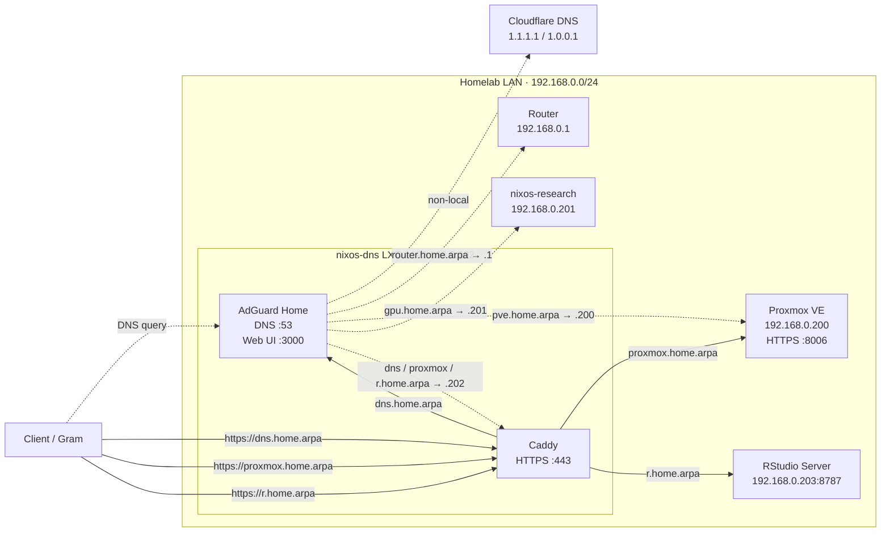

# nix-config

Personal NixOS configurations managed with flakes.

This repository currently manages four environments:

- **LG Gram (`gram`)**: personal NixOS laptop
- **WSL (`wsl`)**: NixOS-WSL development environment
- **Research VM (`nixos-research`)**: GPU-enabled NixOS research VM on Proxmox
- **DNS container (`nixos-dns`)**: NixOS LXC providing local DNS and HTTPS reverse proxy services

System configuration, hardware support, desktop applications, and general-purpose command-line tools belong in this repository.

Project-specific runtimes and dependencies—such as Python or R versions, geospatial libraries, machine-learning frameworks, and project-specific CUDA toolkits—should be managed within each project's reproducible environment, preferably through a Nix flake/devShell, Pixi, or another project-local environment manager.

System-level hardware configuration, including GPU drivers, remains in this repository.

Shared interactive shell/editor behavior comes from the [`dotfiles`](https://github.com/YONGHUNI/dotfiles) flake input. The shared Bash prompt detects interactive `nix shell`, `nix develop`, Pixi, Python/Conda, and Git context without auto-activating a project environment.

## Homelab topology

The homelab uses `nixos-dns` as the local DNS and HTTPS entry point. AdGuard Home resolves `home.arpa` names, while Caddy reverse-proxies browser-facing services to their actual hosts and ports.



The naming scheme distinguishes host names from service names:

| Name | Address | Meaning |
| --- | --- | --- |
| `router.home.arpa` | `192.168.0.1` | Router host |
| `pve.home.arpa` | `192.168.0.200` | Proxmox host itself |
| `gpu.home.arpa` | `192.168.0.201` | Research VM itself |
| `dns.home.arpa` | `192.168.0.202` | AdGuard Home UI through Caddy |
| `proxmox.home.arpa` | `192.168.0.202` | Proxmox web UI through Caddy |
| `r.home.arpa` | `192.168.0.202` | RStudio Server through Caddy |

`pve.home.arpa` and `proxmox.home.arpa` intentionally have different roles: the former identifies the Proxmox host directly, while the latter is the browser-friendly reverse-proxied web endpoint.

## Repository layout

```text
.
├── certs/
│   └── caddy-root.crt
├── flake.nix
├── flake.lock
├── README.md
├── docs/
│   ├── dns-container.md
│   ├── gram-touchpad.md
│   ├── homelab.md
│   ├── hop.md
│   ├── kakaotalk-bottles.md
│   └── research-vm.md
├── home/
│   ├── common.nix
│   └── yonghun.nix
├── hosts/
│   ├── gram/
│   │   ├── configuration.nix
│   │   ├── hardware-configuration.nix
│   │   └── home.nix
│   ├── nixos-dns/
│   │   └── configuration.nix
│   ├── nixos-research/
│   │   ├── configuration.nix
│   │   └── hardware-configuration.nix
│   └── wsl/
│       └── configuration.nix
├── modules/
│   └── nixos/
│       └── laptop.nix
└── pkgs/
    └── hop/
        └── default.nix
```

## Configuration overview

### LG Gram

- NixOS 26.05
- KDE Plasma 6 desktop
- Home Manager
- Plasma Manager
- Fcitx5 Korean input
- systemd-boot
- LUKS-encrypted root and swap
- TPM2-based LUKS unlocking
- GeoClue-based automatic time-zone selection
- Flatpak and Bottles
- System Wine for the KakaoTalk Bottle
- HOP HWP/HWPX editor
- LG Gram touchpad hotkey and LED handling
- Homelab Caddy root CA trust
- Base desktop and command-line tools

### Research VM

- NixOS 26.05
- Proxmox/QEMU guest integration
- NVIDIA GPU support for the passed-through research GPU
- SSH key-only remote access with root login disabled
- Dedicated persistent `/data` filesystem
- Managed research workspace under `/data/yonghun`
- Minimal host-level administrative tools
- Project-specific research environments kept outside the system configuration

### DNS container

- NixOS 26.05 in a Proxmox LXC container
- [AdGuard Home](https://github.com/AdguardTeam/AdGuardHome) for upstream DNS and local [`home.arpa`](https://www.rfc-editor.org/rfc/rfc8375.html) rewrites
- [Caddy](https://caddyserver.com/) for HTTPS reverse proxying
- Caddy internal CA for local TLS
- SSH key-only remote access with root login disabled

See [Homelab architecture](docs/homelab.md), [Research VM](docs/research-vm.md), and [DNS container](docs/dns-container.md) for infrastructure and guest-specific details.

### WSL

- NixOS-WSL
- NixOS 25.11 package set retained
- Automatic Nix cleanup of generations older than seven days
- General-purpose command-line tools
- Python editor/lint tooling plus YAML and Nix tooling
- `nrs` and `nrt` rebuild aliases
- No institution-specific Kerberos/GSSAPI configuration

The WSL host is intentionally generic. Institution-specific SSH, Kerberos, proxy, module, or cluster settings should be added only when a current environment actually requires them.

## Shared shell and project environments

`home/common.nix` links the shared Bash, Vim, and tmux configuration from the `dotfiles` input on Home Manager-managed hosts.

The Bash prompt shows active environment context on the right side:

- interactive `nix shell` as ` nix:shell`
- `nix develop` as ` nix:dev`, or ` nix:<name>` when `NIX_SHELL_NAME` is exported by the project
- Pixi as ` pixi:<project>`
- Python virtual environments as ` <venv>`
- Conda environments as ` <environment>`
- Git branch and working-tree counts

Nested Nix and Pixi contexts are grouped together, for example:

```text
  nix:dev +  pixi:my-project   main ~1
```

Interactive `nix shell` needs a small Bash wrapper because, unlike `nix develop`, it does not expose a dedicated prompt marker. The wrapper only marks an interactive `nix shell`; `nix shell ... -c ...` and other Nix subcommands are passed through normally.

When the terminal is too narrow to fit both sides, the environment/Git modules move automatically to a separate right-aligned line instead of colliding with the host/memory/timer section.

Project environments are not auto-activated by the shared dotfiles. Enter them explicitly, for example:

```bash
nix shell nixpkgs#python3
nix develop
pixi shell
```

A global `.Rprofile` is intentionally not deployed. R package/library paths should come from the active project environment (for example Nix, Pixi, or `renv`) rather than a shared `~/R/library`.

## Common commands

### Gram

```bash
cd ~/nix-config

# Evaluate the flake
nix flake check

# Build without changing the active system generation
sudo nixos-rebuild build --flake .#gram

# Apply the configuration
sudo nixos-rebuild switch --flake .#gram
```

### Research VM

```bash
cd ~/nix-config

sudo nixos-rebuild build --flake .#nixos-research
sudo nixos-rebuild switch --flake .#nixos-research
```

### DNS container

```bash
cd /etc/nixos/nix-config

sudo nixos-rebuild build --flake .#nixos-dns
sudo nixos-rebuild switch --flake .#nixos-dns
```

### WSL

```bash
cd ~/nix-config

sudo nixos-rebuild build --flake .#wsl
sudo nixos-rebuild switch --flake .#wsl
```

The WSL configuration also provides the following aliases:

```bash
nrt
nrs
```

- `nrt`: test the `wsl` configuration
- `nrs`: switch to the `wsl` configuration

## Updating flake inputs

The configurations use separate nixpkgs inputs where required:

- `nixpkgs`: NixOS 26.05 for the Gram, research VM, and DNS container
- `nixpkgs-wsl`: NixOS 25.11 for WSL
- `dotfiles`: shared Bash/Vim/tmux configuration

Update all flake inputs with:

```bash
cd ~/nix-config
nix flake update
```

When only the shared shell/editor configuration changed, update just that input:

```bash
nix flake update dotfiles
```

Review the lock-file changes before rebuilding:

```bash
git diff flake.lock
```

Then build and apply the relevant configuration with the commands above.

## Deploying

### Gram

Clone the repository:

```bash
git clone https://github.com/YONGHUNI/nix-config.git ~/nix-config
cd ~/nix-config
```

The `gram` configuration is tied to the current LG Gram hardware and disk layout.

In particular, it contains machine-specific configuration for:

- EFI and filesystem UUIDs
- LUKS root and swap devices
- Btrfs subvolumes
- TPM2-based unlocking
- LG-specific input and LED behavior

`hosts/gram/hardware-configuration.nix` must not be reused unchanged on another machine.

TPM enrollment is machine-local state and is not reproduced by cloning this repository. Each encrypted volume must be enrolled separately with `systemd-cryptenroll` when rebuilding the machine from scratch.

After restoring the expected disk and encryption layout:

```bash
sudo nixos-rebuild switch --flake .#gram
```

### Research VM

Clone the repository inside the VM and apply the research host configuration:

```bash
git clone https://github.com/YONGHUNI/nix-config.git ~/nix-config
cd ~/nix-config
sudo nixos-rebuild switch --flake .#nixos-research
```

The `nixos-research` configuration assumes the surrounding Proxmox VM already provides the expected virtual hardware, GPU passthrough, boot disk, and persistent data disk. Those hypervisor-side resources are intentionally not reproduced by this repository.

`hosts/nixos-research/hardware-configuration.nix` contains machine-specific filesystem UUIDs and should be regenerated or reviewed when recreating the VM.

### DNS container

The `nixos-dns` configuration assumes the Proxmox LXC container and its network attachment already exist. Apply the guest configuration from the repository inside the container:

```bash
cd /etc/nixos/nix-config
sudo nixos-rebuild switch --flake .#nixos-dns
```

Container creation, addressing, and Proxmox-side firewall or bridge configuration remain outside this repository.

### WSL

```bash
git clone https://github.com/YONGHUNI/nix-config.git ~/nix-config
cd ~/nix-config
sudo nixos-rebuild switch --flake .#wsl
```

## Home Manager

Shared user dotfiles are managed in:

```text
home/common.nix
```

This links the Bash, Vim, and tmux files from the locked `dotfiles` input for the Gram, research VM, and DNS container.

Shared user packages and the Fcitx5 input-method profile are managed in:

```text
home/yonghun.nix
```

LG Gram-specific Plasma configuration is managed in:

```text
hosts/gram/home.nix
```

This includes:

- the remapped touchpad hotkey
- automatic touchpad discovery through KWin
- touchpad LED synchronization
- desktop applications specific to the Gram

## Documentation

- [Homelab architecture](docs/homelab.md)
- [Research VM (`nixos-research`)](docs/research-vm.md)
- [DNS container (`nixos-dns`)](docs/dns-container.md)
- [LG Gram 터치패드 Fn+F5 및 상태 LED](docs/gram-touchpad.md)
- [HOP 패키징 및 실행](docs/hop.md)
- [Bottles와 카카오톡](docs/kakaotalk-bottles.md)

## Repository scope

Included:

- NixOS host configurations
- Home Manager user configuration
- Hardware and boot settings for managed NixOS systems
- General-purpose system and user tools
- Locally packaged desktop applications
- Reproducible Flatpak declarations
- Host-level Wine and application support
- Guest-side configuration for the Proxmox research VM and DNS LXC
- Public CA certificates required by managed clients
- Documentation of the homelab boundary relevant to managed NixOS guests

Excluded:

- Proxmox host configuration and VM/LXC lifecycle state
- Hypervisor-side ZFS, PCI passthrough, and virtual network configuration
- Project-specific Python and R environments
- Project-specific CUDA toolkits and machine-learning frameworks
- Institution-specific Kerberos/SSH/cluster configuration that is no longer generally required
- Large datasets
- Private keys and credentials
- Bottles and Wine prefix data
- Application-generated files
- Nix build-result symlinks such as `result`

## Related repositories

- [dotfiles](https://github.com/YONGHUNI/dotfiles): shared Bash, Vim, and tmux configuration
