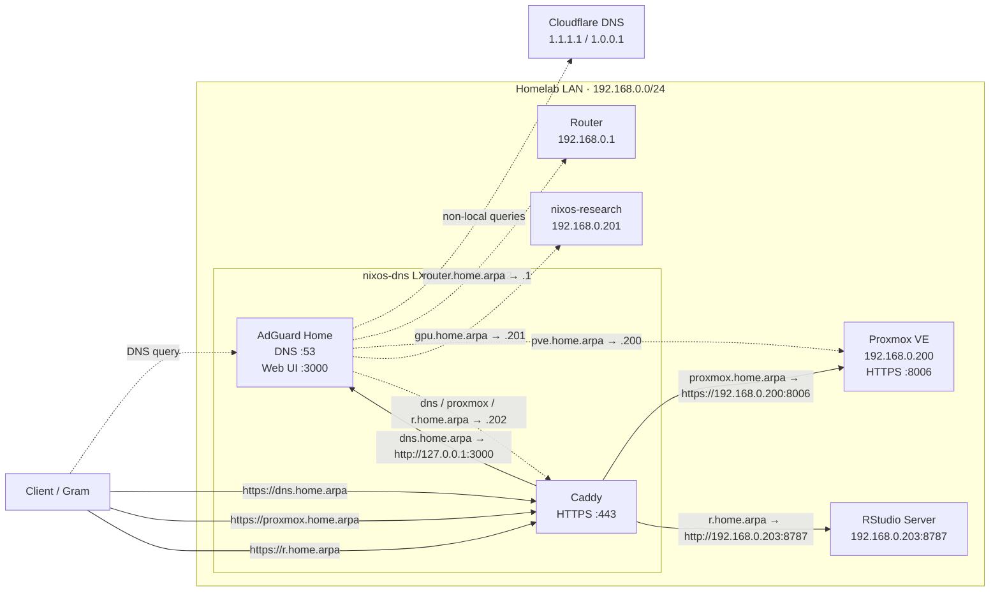
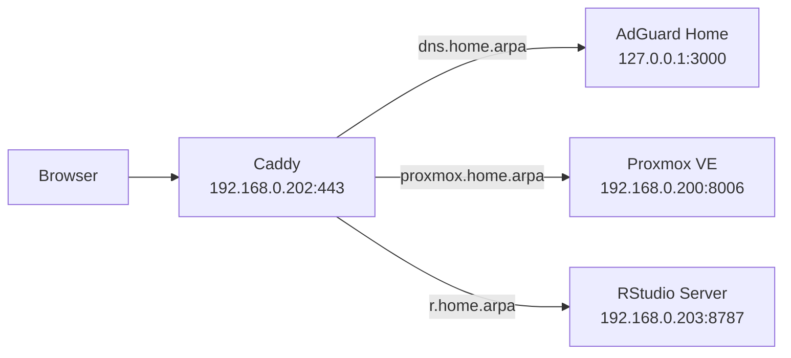

# DNS container (`nixos-dns`)

## Purpose

`nixos-dns` is a small NixOS LXC container that provides local DNS and HTTPS access to homelab web services.

[AdGuard Home](https://github.com/AdguardTeam/AdGuardHome) handles upstream DNS and local host rewrites. [Caddy](https://caddyserver.com/) provides the HTTPS reverse proxy and issues certificates from its internal CA.

## Configuration entry point

The host is exposed by `flake.nix` as:

```text
nixosConfigurations.nixos-dns
```

and is implemented in:

```text
hosts/nixos-dns/configuration.nix
```

Build or apply it with:

```bash
cd /etc/nixos/nix-config
sudo nixos-rebuild build --flake .#nixos-dns
sudo nixos-rebuild switch --flake .#nixos-dns
```

## Current guest configuration

The current configuration provides:

- NixOS 26.05 with the Proxmox LXC module
- hostname `nixos-dns`
- OpenSSH with root login and password authentication disabled
- authorized-key access for user `yonghun`
- AdGuard Home on `192.168.0.202:53`
- Cloudflare DNS upstreams (`1.1.1.1` and `1.0.0.1`)
- local `home.arpa` rewrites
- Caddy on ports 80 and 443
- local HTTPS certificates from Caddy's internal CA

The Proxmox host remains responsible for creating the container, allocating resources, attaching it to the bridge, and assigning its address.

## Network topology

The DNS container has two distinct responsibilities:

1. **AdGuard Home** resolves local `home.arpa` names and forwards non-local DNS queries upstream.
2. **Caddy** terminates local HTTPS connections and reverse-proxies web applications to their actual service ports.



Dashed arrows represent DNS resolution. Solid arrows represent application traffic after the client has resolved a name.

## Local DNS

The current local names are:

| Name | Address | Role |
| --- | --- | --- |
| `router.home.arpa` | `192.168.0.1` | Router host |
| `pve.home.arpa` | `192.168.0.200` | Proxmox host itself |
| `gpu.home.arpa` | `192.168.0.201` | Research VM itself |
| `dns.home.arpa` | `192.168.0.202` | AdGuard Home web UI through Caddy |
| `proxmox.home.arpa` | `192.168.0.202` | Proxmox web UI through Caddy |
| `r.home.arpa` | `192.168.0.202` | RStudio Server through Caddy |

[`home.arpa`](https://www.rfc-editor.org/rfc/rfc8375.html) is the special-use domain reserved for residential home networks.

AdGuard Home listens on port 53 and forwards non-local queries to the configured upstream resolvers. Local names are generated from the `localHosts` attribute set in `hosts/nixos-dns/configuration.nix`.

### Host names versus service names

The naming scheme deliberately distinguishes a machine from a web service exposed through Caddy.

```text
pve.home.arpa
    → 192.168.0.200
    → Proxmox host itself
    → useful for SSH, ping, and direct host access

proxmox.home.arpa
    → 192.168.0.202
    → Caddy
    → https://192.168.0.200:8006
    → browser-friendly Proxmox web UI
```

Therefore `https://pve.home.arpa` is not expected to work on port 443. Direct Proxmox web access through the host name requires `https://pve.home.arpa:8006`, while the preferred browser endpoint is `https://proxmox.home.arpa`.

The same distinction applies conceptually to `gpu.home.arpa`: it names the research VM itself rather than a reverse-proxied application.

## HTTPS reverse proxy

Caddy fronts the web interfaces so they can be reached without explicit service ports:



Equivalent request paths are:

```text
https://dns.home.arpa
    → Caddy
    → http://127.0.0.1:3000

https://proxmox.home.arpa
    → Caddy
    → https://192.168.0.200:8006

https://r.home.arpa
    → Caddy
    → http://192.168.0.203:8787
```

Relevant Caddy documentation:

- [`reverse_proxy`](https://caddyserver.com/docs/caddyfile/directives/reverse_proxy)
- [`tls internal`](https://caddyserver.com/docs/caddyfile/directives/tls)

## Local TLS

The `home.arpa` HTTPS endpoints use Caddy's internal CA rather than a public ACME certificate.

The public root certificate is stored in the repository at:

```text
certs/caddy-root.crt
```

The Gram configuration trusts it declaratively:

```nix
security.pki.certificateFiles = [
  ../../certs/caddy-root.crt
];
```

Other clients must trust the same root certificate in their OS or browser trust store before the local HTTPS endpoints are accepted without warnings.

The root certificate is public material and may be distributed to clients. The corresponding CA private key must never be committed or distributed.

## Remote access

SSH uses public-key authentication only:

```text
PermitRootLogin = no
PasswordAuthentication = false
```

VPN routing and router-side DNS distribution are outside the container configuration. Remote clients must be able to route to `192.168.0.202` and use it as a DNS resolver for `home.arpa` names.

## Rebuild workflow

Update the repository and build the target configuration before switching:

```bash
cd /etc/nixos/nix-config
git pull
sudo nixos-rebuild build --flake .#nixos-dns
sudo nixos-rebuild switch --flake .#nixos-dns
```

Useful checks after a change:

```bash
systemctl status adguardhome
systemctl status caddy
systemctl status sshd
```

From a client using the homelab DNS resolver:

```bash
getent hosts pve.home.arpa
getent hosts dns.home.arpa
getent hosts proxmox.home.arpa
getent hosts r.home.arpa

curl -kI https://pve.home.arpa:8006/
curl -I https://dns.home.arpa/
curl -I https://proxmox.home.arpa/
curl -I https://r.home.arpa/
```

Expected DNS targets:

```text
pve.home.arpa      → 192.168.0.200
proxmox.home.arpa  → 192.168.0.202
dns.home.arpa      → 192.168.0.202
r.home.arpa        → 192.168.0.202
```

A full `nix flake check` evaluates the other hosts in this repository as well and is better run on a machine with more memory when needed.

## Recreating the container

Cloning this repository does not create the Proxmox LXC itself. Proxmox must first provide the container and network attachment.

For the current layout:

1. create a NixOS LXC attached to the homelab bridge
2. assign `192.168.0.202/24` with gateway `192.168.0.1`
3. clone `nix-config` into `/etc/nixos/nix-config`
4. build and switch `.#nixos-dns`
5. verify DNS, Caddy, SSH, and client certificate trust

The exact Proxmox container resources and lifecycle state remain outside this repository.

## Current limitations

- AdGuard Home's direct web port remains available in addition to `https://dns.home.arpa`.
- The Proxmox reverse-proxy upstream currently uses `tls_insecure_skip_verify`, so Caddy encrypts the upstream connection but does not verify the Proxmox certificate. This should eventually be replaced with explicit trust of the Proxmox certificate or CA.
- DNS and reverse proxy services share the same LXC, so loss of `nixos-dns` removes both local name resolution and Caddy-backed service entry points until the container recovers.

## Related documentation

- [Homelab architecture](homelab.md)
- [Research VM (`nixos-research`)](research-vm.md)
- [Repository overview](../README.md)
