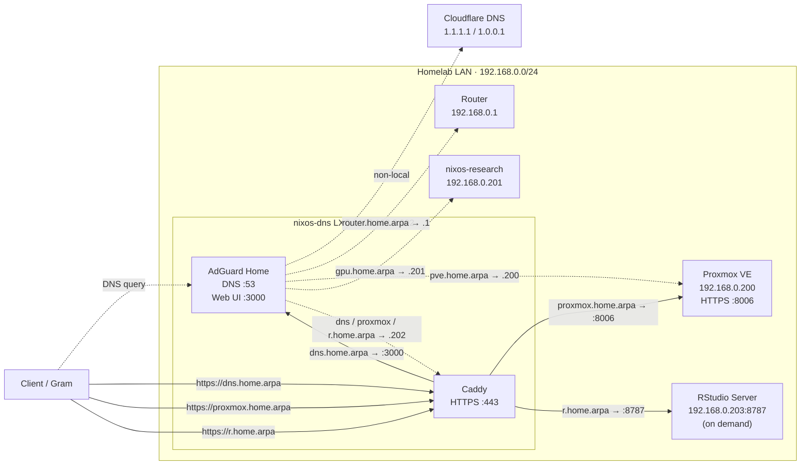

# Homelab architecture

## Purpose

The homelab provides a remotely accessible research-computing platform while keeping NixOS guest configuration reproducible in this repository.

The infrastructure is split into layers. Proxmox manages the physical machine, virtualization, storage, and device assignment. This repository manages the guest-side NixOS systems and services running on top of that infrastructure.

## Architecture



Dashed arrows represent DNS resolution. Solid arrows represent application traffic after a name has been resolved. The RStudio host is an on-demand service and is not expected to be online continuously.

The managed homelab guests are exposed by two flake outputs:

```text
flake.nix
└── nixosConfigurations
    ├── nixos-research
    │   └── hosts/nixos-research/configuration.nix
    └── nixos-dns
        └── hosts/nixos-dns/configuration.nix
```

## Responsibility boundary

### Proxmox layer

The Proxmox host is responsible for infrastructure that must exist before NixOS boots:

- physical hardware management
- VM and LXC creation and lifecycle
- CPU and memory allocation
- virtual disks
- VM/LXC storage and ZFS configuration
- virtual bridges and network attachment
- PCIe device assignment and GPU passthrough
- boot ordering and recovery at the hypervisor level

These settings are not currently declared by `nix-config`.

### NixOS guest layer

The `nixos-research` configuration manages the research VM operating system, NVIDIA guest driver, SSH access, persistent `/data` storage, and QEMU guest integration.

The `nixos-dns` configuration manages the DNS container operating system, SSH access, [AdGuard Home](https://github.com/AdguardTeam/AdGuardHome), local [`home.arpa`](https://www.rfc-editor.org/rfc/rfc8375.html) names, [Caddy](https://caddyserver.com/), and local CA trust material used by managed clients.

See [Research VM](research-vm.md) and [DNS container](dns-container.md) for guest-specific configuration and operational details.

### Project layer

Research projects keep their computational dependencies outside the host configuration.

Examples include:

- Python and R versions
- geospatial libraries
- machine-learning frameworks
- project-specific CUDA user-space dependencies
- notebooks and analysis tools

Prefer a project-local Nix flake and `devShell` where practical. This keeps the research VM small and stable while allowing each project to pin its own environment.

## Storage model

### Hypervisor storage

Proxmox owns the storage used for VM/LXC disks and snapshots. The homelab includes ZFS-backed storage on the Proxmox side.

The exact pool layout, ARC tuning, disk replacement procedure, and snapshot policy belong to the Proxmox infrastructure rather than this repository unless they are later managed declaratively elsewhere.

### Guest research storage

Inside `nixos-research`, a separate persistent filesystem is mounted at:

```text
/data
```

The NixOS configuration creates:

```text
/data/yonghun/
├── projects/
├── datasets/
└── scratch/
```

- `projects/`: research repositories and working code
- `datasets/`: persistent datasets shared across projects
- `scratch/`: disposable or reproducible intermediate data

This keeps research data separate from the VM system disk.

## GPU model

The physical NVIDIA research GPU is assigned to the VM by Proxmox. The hypervisor-side passthrough setup is outside this repository.

Once the GPU is visible inside the guest, `hosts/nixos-research/configuration.nix` configures the NixOS NVIDIA driver stack.

When troubleshooting:

1. If the PCI device is not visible in the VM, check Proxmox/IOMMU/VFIO first.
2. If the device is visible but the NVIDIA driver does not work, check the NixOS guest configuration.

## Networking and remote access

The managed guests attach to the homelab network through Proxmox virtual networking rather than an additional guest NAT layer.

Remote-access transport, router configuration, VPN access, Wake-on-LAN, and Proxmox host management remain infrastructure concerns outside this repository.

The current local names are:

| Name | Address | Purpose |
| --- | --- | --- |
| `router.home.arpa` | `192.168.0.1` | Router |
| `pve.home.arpa` | `192.168.0.200` | Proxmox host |
| `gpu.home.arpa` | `192.168.0.201` | Research VM |
| `dns.home.arpa` | `192.168.0.202` | AdGuard Home through Caddy |
| `proxmox.home.arpa` | `192.168.0.202` | Proxmox web UI through Caddy |
| `r.home.arpa` | `192.168.0.202` | RStudio Server through Caddy; backend at `192.168.0.203:8787` is on demand |

SSH on the NixOS guests uses public-key authentication with root login and password authentication disabled.

## Operational principle

Keep each layer responsible only for what it can reproduce reliably:

```text
Proxmox
  physical resources / virtualization / ZFS / passthrough / VM networking

nix-config
  NixOS guests / drivers / SSH / mounts / DNS / reverse proxy / local CA trust

project repository
  research runtime / libraries / analysis dependencies
```

This reduces coupling between long-lived homelab infrastructure and short-lived research environments.

## Related documentation

- [Research VM (`nixos-research`)](research-vm.md)
- [DNS container (`nixos-dns`)](dns-container.md)
- [Repository overview](../README.md)
